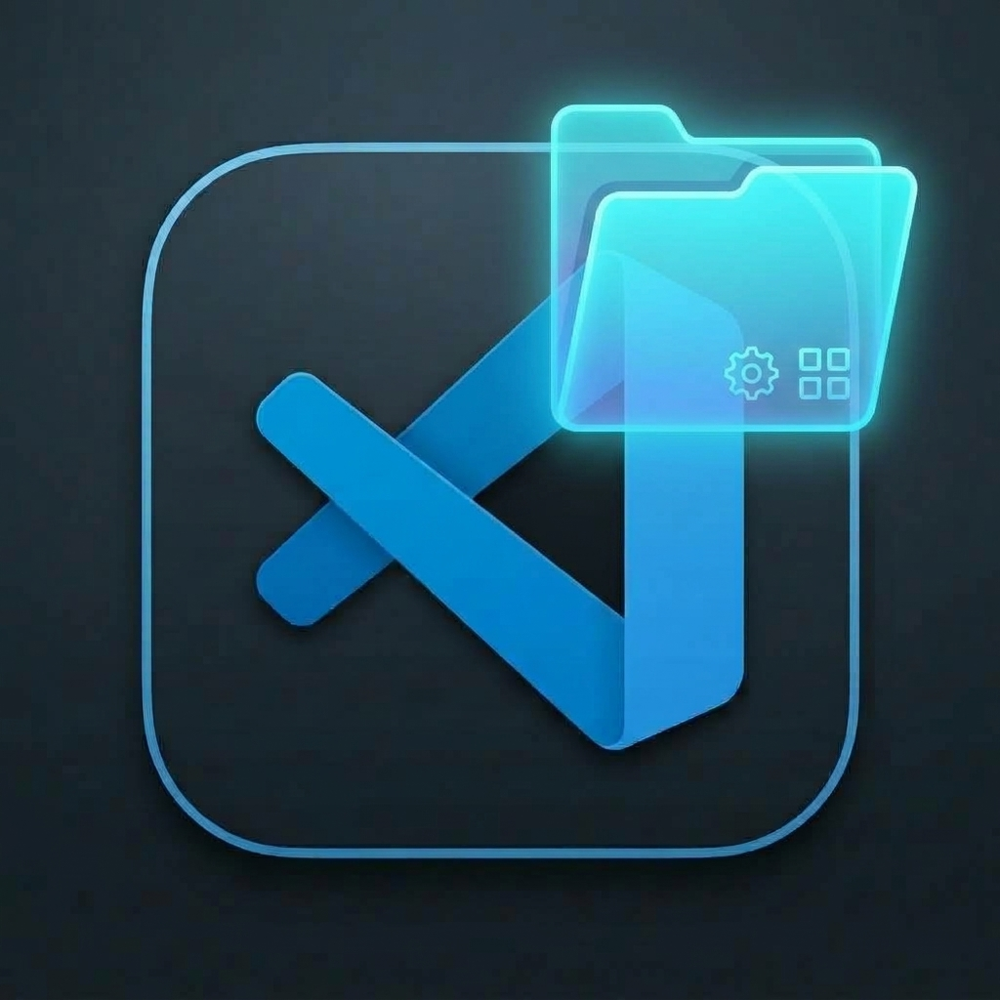

# Workspace Command Manager for Visual Studio Code

<p align="center">
  
</p>

<p align="center">
  <b>Orchestrate, configure, and execute shell commands across multi-repository workspaces with dynamic prompts, per-project overrides, and dedicated terminal management.</b>
</p>

---

## Key Features

- **⚡ Run Saved Command (Preset Runner)**:
  - **Searchable Combobox**: Quickly filter through your commands by typing with live fuzzy matching and keyboard navigation (`↑`/`↓`/`Enter`).
  - **Dynamic User Prompts**: Only displays input fields for options that need values (e.g. `Enter commit message...` for `-m`).
  - **Live Command Preview**: View the exact assembled shell command for each project before execution.
  - **Multi-Select Repositories**: Toggle project checklists with branch badges (`main`, `develop`) and detected package scripts (`start`, `build`, `test`).
  - **1-Click Execution**: Dispatches commands to dedicated terminals mapped to each repository's working directory (`cwd`).

- **➕ Create New Command (Command Builder)**:
  - Configure reusable workflows with friendly names (e.g., `Dev: Start All Services`, `Git: Bulk Commit & Push`).
  - Add custom flags & options (e.g., flag `-m`, placeholder `Enter commit message`, default values, required flags).
  - Configure **Per-Repository Overrides** (e.g., run `ng serve` for an Angular app while other projects run `npm start`).
  - Save directly to `.vscode/workspace-commands.json` (persisted and shareable with team members via git).
  - Test run immediately without saving.

- **Activity Bar & Status Bar Integration**:
  - Custom Activity Bar view container with a Quick Presets tree and master dashboard launcher.
  - Status Bar item `$(folder-library) Workspace Command Manager` for 1-click access anytime.

- **Developer Standards**:
  - Fully typed TypeScript codebase.
  - **ESLint** configured with **Airbnb style guide**.
  - Lightning-fast bundling with **esbuild**.

---

## Extension Views

### Master Dashboard View (Editor Tab)
The main mission-control dashboard provides spacious, comfortable controls for managing multiple projects:
- Top-level mode switcher: `⚡ Run Saved Command` vs `➕ Create New Command`.
- Filterable command selector dropdown.
- Repository status cards with branch badges and script chips.
- Interactive terminal dispatch bar.

### Quick Presets Sidebar (Activity Bar)
- Provides a compact list of your saved presets in the primary sidebar.
- Inline `▶` play buttons to run presets instantly without leaving your editor.
- Click any preset to reveal it in the Master Dashboard.

---

## Installation

### From VSIX Package
Run the following command in your terminal:
```bash
code --install-extension vsc-workspace-command-manager-1.0.0.vsix
```

### From Source
1. Clone or open the repository in VS Code:
   ```bash
   cd vsc-workspace-manager
   npm install
   npm run compile
   ```
2. Press `F5` in VS Code to launch the Extension Development Host window.
3. Open a multi-root workspace (e.g. `test/fixtures/example-workspace/demo.code-workspace`).
4. Click the Workspace Command Manager icon in the Activity Bar or run `Workspace Command Manager: Open Workspace Command Manager Dashboard` from the Command Palette (`Ctrl+Shift+P` / `Cmd+Shift+P`).

---

## Development & Testing

- **Compile**: `npm run compile`
- **Watch**: `npm run watch`
- **Lint (Airbnb Style Guide)**: `npm run lint`
- **Tests**: `npm test`
- **Package VSIX**: `npx @vscode/vsce package --no-dependencies --allow-missing-repository`

---

## License
MIT
